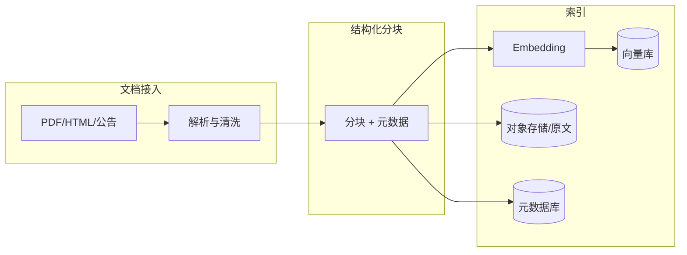
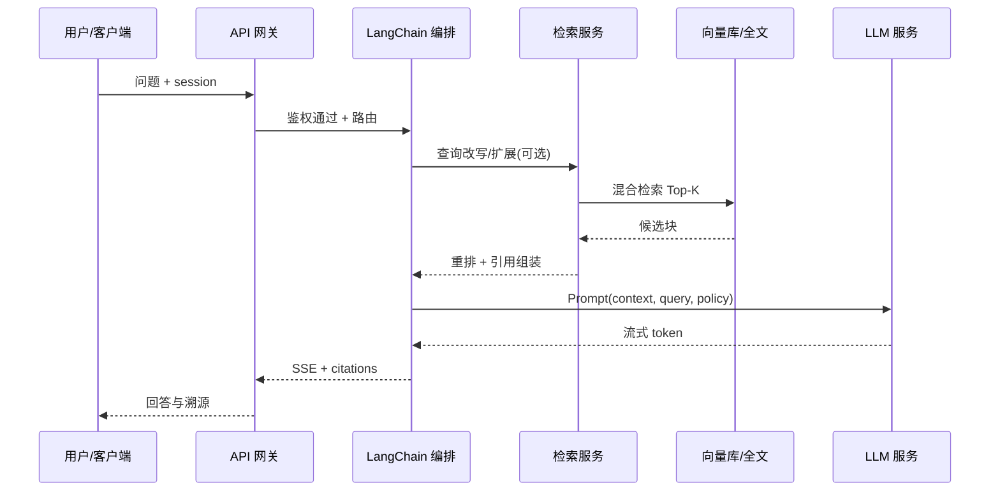
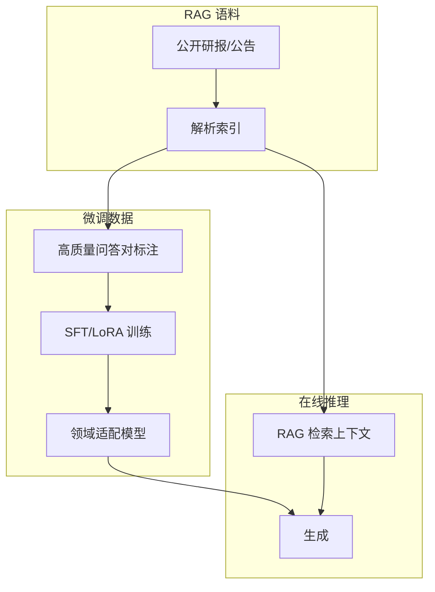

# 金融场景 RAG + 微调 项目 — 系统架构设计

## 1. 文档说明

| 项 | 内容 |
| --- | --- |
| 版本 | v1.0 |
| 适用场景 | 金融研报/公告/条款问答、合规辅助、内部知识检索 |
| 架构范式 | 检索增强生成（RAG）与领域微调（SFT / LoRA）协同 |

本文描述系统分层、技术栈、核心模块、RAG 与微调的数据流及部署视图，作为实现与评审的基线。

---

## 2. 建设目标与原则

- **RAG**：解决知识时效性、可溯源、减少幻觉；答案绑定检索片段与元数据（来源、日期、文档类型）。
- **微调**：在通用大模型之上注入金融术语、写作风格、任务格式（如摘要、风险点提取、合规 checklist）。
- **协同策略**：线上推理以 RAG 为主、基座 + 适配器（LoRA）为辅；微调数据优先来自经审核的金融语料与高质量标注。
- **合规**：日志审计、权限隔离、敏感信息脱敏；生产环境不将原始客户 PII 用于无授权训练。

---

## 3. 系统架构层次

```
┌─────────────────────────────────────────────────────────────────┐
│  表现层 / 渠道层：Web、企业微信/钉钉、API 网关、管理后台              │
├─────────────────────────────────────────────────────────────────┤
│  应用服务层：会话管理、鉴权、配额、审计、业务编排（LangChain / LCEL） │
├─────────────────────────────────────────────────┬───────────────┤
│  RAG 子系统：解析、分块、向量化、检索、重排、引用组装               │  微调子系统    │
├─────────────────────────────────────────────────┤  数据管线、    │
│  模型服务层：Embedding、Reranker、LLM（API / 本地 vLLM）           │  训练、评估、  │
├─────────────────────────────────────────────────┤  模型注册      │
│  数据层：对象存储、向量库、元数据库、特征/样本库、实验追踪           │                │
└─────────────────────────────────────────────────┴───────────────┘
```

| 层次 | 职责 | 典型组件 |
| --- | --- | --- |
| L1 表现与接入 | UI、OpenAPI、流式输出、文件上传 | FastAPI / Next.js、SSE |
| L2 应用与编排 | 多轮对话、工具调用、链路与 Agent、熔断降级 | LangChain、LangGraph（可选） |
| L3 RAG 引擎 | 文档生命周期、索引、混合检索、重排、上下文裁剪 | LangChain Retrievers、自研 pipeline |
| L4 模型服务 | 统一推理接口、批处理、GPU 调度 | vLLM / TGI、云厂商推理端点 |
| L5 数据与治理 | 向量索引、原文存储、血缘、版本化数据集 | Milvus / PGVector、MinIO、MLflow |

---

## 4. 技术栈

### 4.1 编排与框架

| 类别 | 技术选型 | 说明 |
| --- | --- | --- |
| 应用框架 | Python 3.11+、FastAPI | 异步 IO、OpenAPI 原生 |
| LLM 编排 | **LangChain**、LangSmith（可选） | Chains、Retrievers、Callbacks、可观测 |
| 复杂流程 | LangGraph（可选） | 多步审批、人机协同 |

### 4.2 模型与推理

| 类别 | 技术选型 | 说明 |
| --- | --- | --- |
| 基座 LLM | Qwen / Llama / GLM 等（API 或开源权重） | 按算力与合规选型 |
| Embedding | bge-m3、e5、金融领域 embedding（若有） | 与向量维度、语种一致 |
| Reranker | bge-reranker、Cross-Encoder | 提升 Top-K 精度 |
| 推理加速 | vLLM、TensorRT-LLM（可选） | 高并发、低延迟 |
| 量化 | AWQ / GPTQ / bitsandbytes | 降显存、边侧部署 |

### 4.3 RAG 与存储

| 类别 | 技术选型 | 说明 |
| --- | --- | --- |
| 向量数据库 | Milvus / Qdrant / **PGVector** | 规模与运维成本权衡 |
| 全文检索 | Elasticsearch / OpenSearch（可选） | 混合检索、金融精确词 |
| 对象存储 | MinIO / S3 / 本地 NAS | PDF、HTML、解析中间件 |
| 文档解析 | unstructured、pdfplumber、自研表格解析 | 表格与脚注对金融很关键 |

### 4.4 微调与实验

| 类别 | 技术选型 | 说明 |
| --- | --- | --- |
| 训练框架 | **PyTorch**、Hugging Face **Transformers**、**TRL**（SFT/DPO） | 标准 SFT 管线 |
| 参数高效微调 | **PEFT**（LoRA / QLoRA） | 显存友好、多任务多适配器 |
| 数据处理 | datasets、tokenizers | 可复现数据管线 |
| 实验追踪 | MLflow、Weights & Biases（可选） | 超参、指标、模型版本 |
| 评估 | ragas、自研金融评测集 | RAG 与生成质量分离度量 |

### 4.5 工程与运维

Docker、Kubernetes（可选）、Redis（会话/缓存）、PostgreSQL（业务与元数据）、Prometheus + Grafana（监控）、结构化日志与审计中间件。

---

## 5. 核心模块

| 模块 | 功能摘要 | 关键接口/产出 |
| --- | --- | --- |
| **文档接入** | 上传、拉取（URL/同步）、格式校验、病毒扫描钩子 | 原始文件 URI、任务 ID |
| **解析与分块** | 版面分析、表格结构化、按语义/结构分块、元数据注入 | Chunk 列表 + metadata |
| **索引构建** | Embedding 批处理、向量 upsert、全文索引写入 | collection / index 版本号 |
| **检索服务** | 向量检索、关键词/BM25、混合融合、MMR、时间/类型过滤 | Top-K 文档块 |
| **重排与压缩** | Cross-Encoder 重排、上下文窗口压缩、引用对齐 | 最终 context + citations |
| **生成服务** | Prompt 模板、流式生成、拒绝回答策略、免责声明 | 回答 + 溯源列表 |
| **会话与权限** | 租户隔离、知识库 ACL、审计日志 | session_id、audit_event |
| **微调数据工厂** | 指令数据合成（可选）、人工标注、质量门禁 | JSONL 训练集 |
| **训练作业** | 配置模板、GPU 任务、checkpoint、合并导出 | adapter / merged 权重 |
| **模型注册** | 版本、基座关联、评估报告、灰度标签 | model_id |
| **评测与监控** | 离线集测、线上抽样、LangSmith 轨迹 | 指标看板 |

---

## 6. RAG 流程与数据流向

### 6.1 索引侧（离线 / 近实时）



**数据流说明**：原始文档经解析得到带 `source`、`publish_date`、`doc_type`、`page` 等元数据的文本块；块量 Embedding 后写入向量库；原文与块映射持久化，供生成阶段做引用展示与权限校验。

### 6.2 查询侧（在线）



**关键步骤**：查询理解（可选）→ 检索（向量 + 可选关键词）→ 重排 → 上下文与系统策略拼装 → 带引用的生成 → 后处理（金额/日期格式、合规话术）。

### 6.3 RAG 与微调的协同数据流



- **数据血缘**：微调样本应标注来源文档 ID，便于复现与合规审计。
- **负样本**：检索未命中或拒答场景可进入 DPO/偏好数据，改善「不知道就说不知道」。

---

## 7. 部署架构（参考）

- **开发**：单机 Docker Compose（API + 向量库 + MinIO + Redis）。
- **测试/预发**：与生产同构缩小实例；独立向量 collection。
- **生产**：API 多副本无状态；模型服务与向量库分离扩缩容；密钥走 KMS；南北向 TLS。

---

## 8. 安全与合规要点（金融）

- 知识库与租户强绑定；行列级权限过滤检索结果。
- 训练数据脱敏与授权清单；禁止未授权客户数据进入共享训练池。
- 输出强制携带免责声明；高风险意图（投资建议、法律结论）走模板或人工 escalated 流程（可 LangGraph）。

---

## 9. 文档修订记录

| 版本 | 日期 | 变更说明 |
| --- | --- | --- |
| v1.0 | 2026-04-25 | 初稿 |

---

## 10. 关联文档

- [02-需求规格说明书](./02-需求规格说明书.md)
- [03-项目开发文档](./03-项目开发文档.md)
